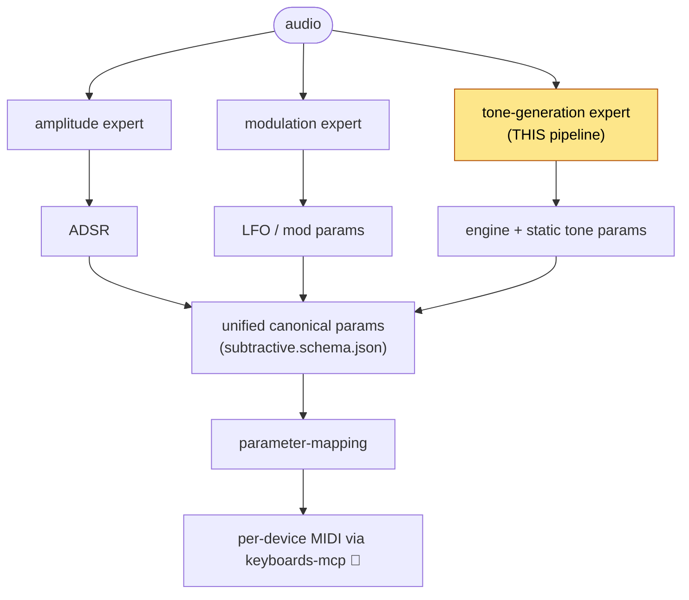
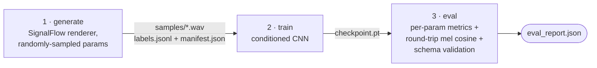

# reverse-synth-research

Research code and design docs for **reverse-engineering a synthesizer patch from audio** — listen to a sound, recover the synth parameters behind it, and reproduce it on a real keyboard.

Alongside the design docs, this repo holds the one **runnable** piece so far: the **subtractive tone-generation training pipeline**, the first of the project's planned ML "experts."

> New here? Install [`uv`](https://docs.astral.sh/uv/) + [`task`](https://taskfile.dev/), then `task install && task pipeline` runs the whole loop end-to-end on synthetic data. See [Quickstart](#quickstart).

## How we hope to use it

The parent project listens to a song, figures out the synth patch behind a sound, and reproduces it on hardware. Audio analysis is split into three orthogonal **experts**, each stripping out one concern; their canonical outputs merge and get translated to per-device knobs:



This repo trains the **tone-generation expert**: given an isolated note — plus the pitches being played, which an upstream transcription step supplies — it predicts the *static* tone parameters of a subtractive synth (what the oscillator and filter are doing). Its output is a canonical [`subtractive.schema.json`](parameter-mapping/subtractive.schema.json) instance, the same contract `parameter-mapping/` will consume to drive [`keyboards-mcp`](https://github.com/uribrecher/keyboards-mcp).

Today it's a deliberately thin **MVP** predicting three parameters — see [Status & limitations](#status--limitations).

## How the training works

There are no labeled real-world recordings of "this audio = these synth knobs," so we **generate** perfectly-labeled data with the same synth engine we're trying to invert, then learn the inverse:



- **generate** — render N synthetic notes/chords with known params (osc shape, LP cutoff, resonance).
- **train** — learn `params ← (log-mel of the sustain region, the played MIDI pitches)`.
- **eval** — score predictions, then re-render them and compare spectrograms.

The renderer is both the **data source** and the **eval oracle**: at eval time we re-render the model's predicted params and measure how close the result *sounds* to the input (mel-cosine similarity). "Good" therefore means "reproduces the sound," not merely "matches the numbers."

Each stage is one script in `scripts/`; the shared logic lives in the `tone_generation` package (`src/tone_generation/`). Flag-level reference: [`src/tone_generation/README.md`](src/tone_generation/README.md).

## The model

`ToneGenerationCNN` ([`src/tone_generation/model.py`](src/tone_generation/model.py)) — a small (~0.7M-param) conditioned CNN:

| | |
|---|---|
| **Inputs** | log-mel spectrogram of the note's sustain region `(1, 128, ~30)` **+** an 88-key MIDI multi-hot of the played pitches (conditioning) |
| **Backbone** | 3 conv blocks → adaptive-pool over time (frequency preserved) → flatten → concat the pitch multi-hot → 2-layer MLP |
| **Heads** | `shape` (4-class: sine / saw / square / triangle) · `cutoff_hz` (regression, log-Hz) · `resonance` (regression, [0, 1]) |
| **Output** | a schema-conformant `subtractive.schema.json` instance |
| **Artifact** | `checkpoint.pt` — a plain PyTorch `state_dict` |

Pitch enters as a *conditioning input* (not something the model must infer), mirroring the deployed flow where transcription provides the notes — so the model can focus purely on timbre.

## Quickstart

Requires [`uv`](https://docs.astral.sh/uv/) and [`task`](https://taskfile.dev/) (macOS: `brew install go-task`).

```bash
task install        # uv sync --dev  (installs signalflow, torch, …)
task pipeline       # generate → train → eval, end-to-end on synthetic data
```

Step by step, tweaking the knobs:

```bash
task generate N_SAMPLES=2000 SEED=0     # a smaller dataset
task train EPOCHS=20
task eval
```

`task` (no args) lists everything:

| Task | What it does |
|------|--------------|
| `install` | `uv sync --dev` |
| `generate` | render the synthetic dataset (`N_SAMPLES`, `SEED`, `DATASET_DIR`) |
| `train` | train the CNN (`DATASET_DIR`, `CHECKPOINT`, `EPOCHS`, `SEED`) |
| `eval` | evaluate a checkpoint (`CHECKPOINT`, `DATASET_DIR`) |
| `pipeline` | `generate → train → eval` |
| `test` / `test:all` | fast unit tests / full suite (incl. the slow smoke) |
| `typecheck` | `mypy src/` |
| `check` | `typecheck` + fast tests (mirrors CI) |
| `clean` | remove generated artifacts under `DATASET_DIR` |

Defaults: `N_SAMPLES=10000`, `SEED=0`, `EPOCHS=50`, `DATASET_DIR=scratch/tone_gen_dataset`, `CHECKPOINT=$DATASET_DIR/checkpoint.pt`.

## Status & limitations

A deliberately thin **MVP** — the smallest slice that exercises both a classification head and regression heads end-to-end:

- **Three free parameters only** (osc shape, LP cutoff, resonance). The amp ADSR is a fixed preset, the filter envelope is inert, and there's no LFO / second oscillator / sub / noise — those belong to the **amplitude** and **modulation** experts.
- **Subtractive engine assumed** — no engine detection / classifier head yet.
- **Trained and evaluated on synthetic renders only** — no real-keyboard recordings, no transcription-noise augmentation, no modulation-invariance training yet.

Deferred work is tracked in the [backlog](docs/superpowers/specs/2026-05-02-subtractive-tone-training-backlog.md). Design docs: [MVP spec](docs/superpowers/specs/completed/2026-05-02-subtractive-tone-training-mvp.md) · [tone-generation research plan](tone-generation/tone-generation-research-plan.md).

## Repo layout

| Path | Contents |
|------|----------|
| `src/tone_generation/` | the training package — `renderer`, `dataset`, `model`, `schema_io` |
| `scripts/` | the three pipeline stages (generate / train / eval) |
| `scratch/` | SignalFlow exploration probes |
| `tests/` | unit + slow end-to-end smoke tests |
| `parameter-mapping/` | the canonical synth schema + ontology these params conform to |
| `amplitude/`, `modulation/`, `tone-generation/`, `docs/` | research design docs |
